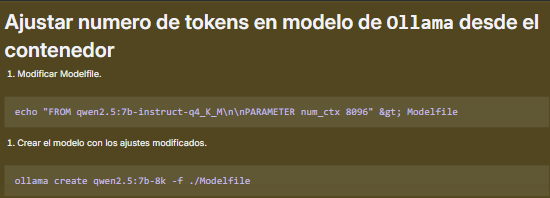

# Agente IA para documentación (Con RAG)

### 1. Interfaz con OpenWebUI.

OpenWeb-UI es una aplicación de codigo abierto que permite "desplegar" tus agentes de IA en una interfaz real y usable, no en la que ofrecen los editores como n8n. 

Una de las novedades que ofrece esta aplicación es la posibilidad de integrar código para añadir funcionalidades a la aplicación, es altamente personalizable. A parte ofrece la posibilidad de generar los titulos y las etiquetas de cada chat usando Inteligencia artificial. [Link al repositorio para su instalación](https://github.com/open-webui/open-webui)

> Se recomienda instalar con Docker/Docker compose. [^1]

[^1]: Archivo `docker-compose.yml`

### 2. Flujo n8n para vectorizar y almacenar documentación.

El flujo que se muestra comienza con un `trigger` en la carpeta `/home/files` de nuestro contenedor, esto quiere decir que cada vez que se añada o actualice uno de sus ficheros, se ejecutará el workflow.

Comienza iterando sobre todos los archivos de la carpeta, por cada iteración extrae metadatos de los archivos y establece un `id`, un tipo y un titulo para cada uno de ellos usando expresiones regulares.

Una vez se han extraido y asignado los datos, mediante una consulta SQL a nuestra base de datos, se eliminan registros anteriores de los archivos y se insertan los extraidos en cada iteración para evitar duplicidades.

lo siguiente es leer el archivo, para ello usamos el nodo `Read/Write files from Disk`, que se encarga, como su nombre indica, de extraer el contenido de los archivos.

Una vez extraída la información del archivo, comprobamos que tipo de archivo es y mediante el uso de un nodo switch, establecemos lo siguiente:

- En caso de ser un **pdf** o un archivo de **texto plano**, se usan los nodos correspondientes a estos y se extrae el contenido para pasarselo directamente a la base de datos vectorial y procesarlos.
- En caso de ser un **archivo de excel o csv**, el flujo es un poco mas complicado ya que tratamos de extraer información sobre la estructura de los datos y añadirla a nuestra base de datos SQL para facilitar al agente encontrar esa información. Para ello usamos nodos como `aggregate` o `summarize`.
- Por último, en caso de ser una **imagen**, se debe implementar la logica correspondiente para extraer información de ella (Pensaba en crear un `MCP server` para abstraer esa lógica).

Por último, todo pasa a la base de datos vectorial para ser vectorizado y almacenado con el modelo de embeddings pertinente.

> En este caso usé `nomic-embed-text:latest de Ollama`

### 3. Nodos de creación de tablas.
Estos nodos deben ser ejecutados si la base de datos no tiene las tablas `document_metadata` o `document_rows`

### 4. Agente IA

Este sería el flujo principal del agente:

El flujo lo activa o bien un chat de prueba de n8n o un nodo webhook que está conectado a nuestra interfaz de Open WebUI, en este caso, le sigue un nodo `IF` para comprobar si la petición tiene un `SessionID`, en caso de tenerlo el flujo va al agente, pero en caso de no tenerlo, significa que OpenWebUI está haciendo una petición para generar etiquetas o el nombre de la conversación como comentamos anteriormente, asique debe ir al nodo correspondiente a tratar esa petición y devolverla correctamente. 

> El segundo caso solo ocurre con el primer mensaje de cada conversación.
> El modelo local usado para el chat es `qwen2.5:7b-instruct-q4_K_M.`[^2]

[^2]: Se puede modificar este modelo para que permita más tokens, ya que el flujo requiere de bastantes con estos dos comandos:

- 4.1. Herramientas y características del Agente.
El flujo cuenta con varios modelos de IA diferentes, en este caso para hacer pruebas tengo OpenAI y Ollama; una memoria en base de datos SQL que guarda la información y los mensajes de cada interacción con el chat; Un set de herramientas SQL para facilitar el acceso a los archivos:
  - **List Documents:**
La primera de las herramientas consiste en hacer un select a nuestra tabla de `documents_metadata`
  - **Get File Documents:**
Esta herramienta recoge el contenido de un archivo según el id de la tabla `documents_pg`.
  - **Query Document row**
usa esta herramienta para consultar la tabla `document_rows` una vez que sabe el `id` del archivo. El `dataset_id` es el mismo que el `file_id`, y siempre usa la columna `row_data` para filtrar, ya que es un campo jsonb que contiene todas las claves del esquema del archivo, según la tabla `document_metadata`.
  - **RAG:**
Esta herramienta es la más sencilla de configurar si todo funciona correctamente ya que solo tenemos que pasarle el nombre de la tabla donde tiene vectorizada toda la información y decirle a nuestro agente que su base de conocimiento es esta. Por último le anidamos un modelo de embeddings para que sea capaz de extraer la información vectorizada y pasarsela a nuestro agente.

### TODO: Añadir información del MCP Server que se desarrolle

