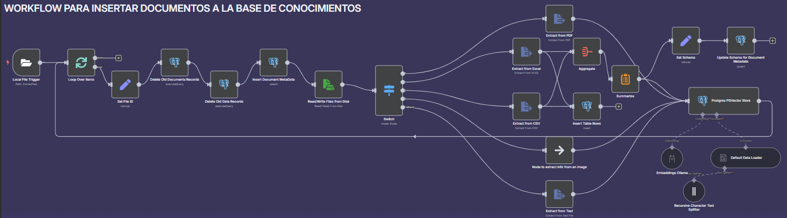
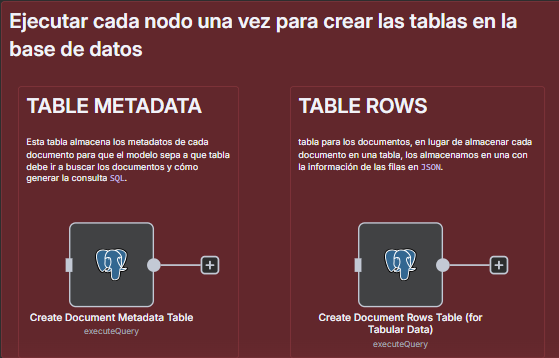
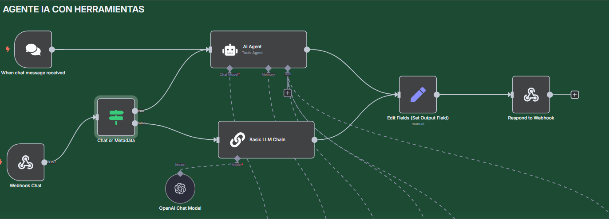
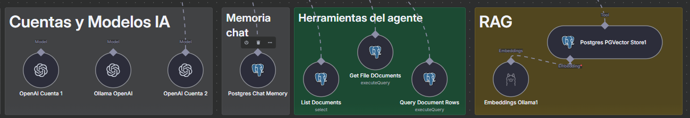

# Agente IA para documentación (Con RAG y MCP servers)

### 1. Interfaz con OpenWebUI.

OpenWeb-UI es una aplicación de codigo abierto que permite "desplegar" tus agentes de IA en una interfaz real y usable, no en la que ofrecen los editores como n8n. 

Una de las novedades que ofrece esta aplicación es la posibilidad de integrar código para añadir funcionalidades a la aplicación, es altamente personalizable. A parte ofrece la posibilidad de generar los titulos y las etiquetas de cada chat usando Inteligencia artificial. [Link al repositorio para su instalación](https://github.com/open-webui/open-webui)

> Se recomienda instalar con Docker/Docker compose. [^1]

[^1]: Archivo `[docker-compose.yml](https://github.com/davidcrm/n8n-development/blob/main/docker-compose.yml)

### 2. Flujo n8n para vectorizar y almacenar documentación.



El flujo que se muestra comienza con un `trigger` en la carpeta `/home/files` de nuestro contenedor, esto quiere decir que cada vez que se añada o actualice uno de sus ficheros, se ejecutará el workflow.

Comienza iterando sobre todos los archivos de la carpeta, por cada iteración extrae metadatos de los archivos y establece un `id`, un tipo y un titulo para cada uno de ellos usando expresiones regulares.

Una vez se han extraido y asignado los datos, mediante una consulta SQL a nuestra base de datos, se eliminan registros anteriores de los archivos y se insertan los extraidos en cada iteración para evitar duplicidades.

lo siguiente es leer el archivo, para ello usamos el nodo `Read/Write files from Disk`, que se encarga, como su nombre indica, de extraer el contenido de los archivos.

Una vez extraída la información del archivo, comprobamos que tipo de archivo es y mediante el uso de un nodo switch, establecemos lo siguiente:

- En caso de ser un **pdf** o un archivo de **texto plano**, se usan los nodos correspondientes a estos y se extrae el contenido para pasarselo directamente a la base de datos vectorial y procesarlos.
- En caso de ser un **archivo de excel o csv**, el flujo es un poco mas complicado ya que tratamos de extraer información sobre la estructura de los datos y añadirla a nuestra base de datos SQL para facilitar al agente encontrar esa información. Para ello usamos nodos como `aggregate` o `summarize`.
- Por último, en caso de ser una **imagen**, se debe implementar la logica correspondiente para extraer información de ella (Pensaba en crear un `MCP server` para abstraer esa lógica).

Por último, todo pasa a la base de datos vectorial para ser vectorizado y almacenado con el modelo de embeddings pertinente.

> En este caso usé `nomic-embed-text:latest de Ollama`

### 3. Nodos de creación de tablas.
Estos nodos deben ser ejecutados si la base de datos no tiene las tablas `document_metadata` o `document_rows`


### 4. Agente IA

Este sería el flujo principal del agente:


El flujo lo activa o bien un chat de prueba de n8n o un nodo webhook que está conectado a nuestra interfaz de Open WebUI, en este caso, le sigue un nodo `IF` para comprobar si la petición tiene un `SessionID`, en caso de tenerlo el flujo va al agente, pero en caso de no tenerlo, significa que OpenWebUI está haciendo una petición para generar etiquetas o el nombre de la conversación como comentamos anteriormente, asique debe ir al nodo correspondiente a tratar esa petición y devolverla correctamente. 

> El segundo caso solo ocurre con el primer mensaje de cada conversación.
> El modelo local usado para el chat es `qwen2.5:7b-instruct-q4_K_M.`[^2]

[^2]: Se puede modificar este modelo para que permita más tokens, ya que el flujo requiere de bastantes con estos dos comandos: 


- 4.1. Herramientas y características del Agente.
El flujo cuenta con varios modelos de IA diferentes, en este caso para hacer pruebas tengo OpenAI y Ollama; una memoria en base de datos SQL que guarda la información y los mensajes de cada interacción con el chat; Un set de herramientas SQL para facilitar el acceso a los archivos:
  - **List Documents:**
La primera de las herramientas consiste en hacer un select a nuestra tabla de `documents_metadata`
  - **Get File Documents:**
Esta herramienta recoge el contenido de un archivo según el id de la tabla `documents_pg`.
  - **Query Document row**
usa esta herramienta para consultar la tabla `document_rows` una vez que sabe el `id` del archivo. El `dataset_id` es el mismo que el `file_id`, y siempre usa la columna `row_data` para filtrar, ya que es un campo jsonb que contiene todas las claves del esquema del archivo, según la tabla `document_metadata`.
  - **RAG:**
Esta herramienta es la más sencilla de configurar si todo funciona correctamente ya que solo tenemos que pasarle el nombre de la tabla donde tiene vectorizada toda la información y decirle a nuestro agente que su base de conocimiento es esta. Por último le anidamos un modelo de embeddings para que sea capaz de extraer la información vectorizada y pasarsela a nuestro agente.




### 5. MCP Servers
Los MCP servers (Model Context Protocol) son servidores que gestionan la comunicación estructurada entre agentes de IA y otros sistemas. Permiten enviar y recibir mensajes en un formato definido, facilitando la integración modular de componentes. Se usan en agentes de IA para coordinar tareas, responder preguntas o acceder a herramientas externas de forma ordenada y eficiente.

La estructura de los servidores MCP tal cual están planteados en este proyecto es la siguiente:
1. Carpeta **public** (Opcional):
Tiene elementos estáticos a los que se puede acceder, ya sean imágenes, plantillas o datos de cualquier tipo.
2. Carpeta **scr**:
En esta carpeta se encuentra la lógica del servicio, tendremos como mínimo dos archivos, uno en el que declararemos el servidor y las herramientas (main.py) y otro con funciones y servicios para modularizar el código y que sea más mantenible (utils.py). Las posibilidades son infinitas.
3. Fichero **.env**:
En este fichero estableceremos nuestras variables de entorno, por defecto hay un ejemplo en cada servicio que contiene lo básico (IP, puerto, Transport, etc). Puedes añadir y retirar cuantas necesites.
4. **Dockerfile**:
Este fichero, crea una imagen de docker con el servidor que hemos creado, para luego poder crear contenedores con ellas.
    
Comando para crear la imagen:
    
    docker build -t mcp/<nombre-del-servicio> --build-arg PORT=<puerto> .
Comando para levantar un contenedor con la imagen:
    
    docker run --env-file .env -p <puerto-local>:<puerto-contenedor> --network <red-n8n> mcp/<nombre-de-la-imagen>
    
En este proyecto hay 3 integraciones de MCP Servers. 

- [**MCP-mem0:**](https://github.com/davidcrm/n8n-development/tree/main/mcp-mem0)
Se trata de un servidor encargado de guardar y acceder a datos en una memoria, por ejemplo puedes decirle que trabajas en X empresa, y cuando le preguntes en qué empresas has trabajado, te dirá todas las empresas que tú le has dicho que guarde en su memoria. Es un ejemplo hecho del canal de [Cole Medin](https://youtube.com/@ColeMedin/videos).
- [**MCP-Extract-titles**](https://github.com/davidcrm/n8n-development/tree/main/mcp-extract-titles)
Este servidor es muy sencillo, lo único que hace es, a partir de un texto, bien sea en formato MarkDown o texto plano, extrae lo que considera títulos, para ello se fija en que tenga alguna almohadilla delante (#) que se correspondería con un título en MarkDown o bien que esté escrito en mayúsculas.

- [**MCP-pdf-service](https://github.com/davidcrm/n8n-development/tree/main/mcp-pdf-service)
Este servidor es el más útil de los 3 que hay implementados. Su objetivo es crear un pdf con la información solicitada por el usuario. De momento lo hace en un formato bastante pobre y sin estilos pero en el futuro se puede incluso añadir plantillas para distintos tipos de documentos (facturas, informes, etc.) [*Ejemplos*](https://github.com/davidcrm/n8n-development/tree/main/output).


## Definición de un MCP Server:
1. Importar todo lo necesario para construir nuestro MCP Server:
- `FastMCP, Context`: clases del servidor MCP para manejar peticiones y su contexto.  
- `asynccontextmanager`: decorador para crear contextos asincrónicos (`async with`).  
- `AsyncIterator`: tipo para declarar iteradores asincrónicos.  
- `dataclass`: simplifica la creación de clases de solo datos.  
- `load_dotenv`: carga variables de entorno desde un archivo `.env`.  
- `PdfService`: clase personalizada desde `utils.py` para generar PDFs.  
- `asyncio`: librería estándar para manejar código asincrónico en Python.

2. Cargar las variables de nuestro fichero .env:
```python
load_dotenv()
```
3. Luego crearemos un contexto para nuestro servidor en el que podremos añadir "propiedades" que queramos que tenga. En este caso está vacío pero se podría añadir, por ejemplo, un atributo con el la clase PdfService.

```python
@dataclass
    class AppContext:
        pass
```
4. Definir el ciclo de vida de la aplicación (servidor en este caso):

```python
@asynccontextmanager
async def app_lifespan(server: FastMCP) -> AsyncIterator[AppContext]:
    yield AppContext()
```
El decorador `@asynccontextmanager` se encarga de crear un contexto asíncrono que controla el inicio y el fin del servidor. La función recibe una instancia de FastMCP y devuelve el contexto de la aplicación. `yield AppContext()` indica que al iniciar la aplicación se entrega un contexto para usar durante su ejecución.

5. Instanciar la clase FastMCP con una descripción de nuestro servidor y los valores declarados anteriormente tanto en el `.env` como en el `main.py`

```python
mcp = FastMCP(
    "mcp-pdf-service",
    description="MCP server for generating pdf files with info asked",
    lifespan= app_lifespan,
    host=os.getenv("HOST", "0.0.0.0"),
    port=os.getenv("PORT", "<puerto>")
)   
```
6. Declarar las herramientas de nuestro servidor.

En este caso solo tendremos una herramienta para exportar el pdf. Todas las herramientas se declaran con el decorador `@mcp.tool()` y deben ser asíncronas.

```python
@mcp.tool()
async def generar_pdf(ctx:Context, content: str, title: str = "Report") -> str:
    try: 
        filepath = PdfService.generate_pdf(content, title)

        return f"PDF generado correctamente en la ruta: {filepath}"
    except Exception as e:
        return f"Error generando el PDF: {str(e)}"
```
El código define una herramienta (`@mcp.tool()`) que genera un PDF a partir de un contenido y un título proporcionado. La Herramienta recibe un contexto (`ctx`), el contenido (`content`) y un título opcional (`title`, por defecto "Report"). Utiliza la clase [`PdfService`](https://github.com/davidcrm/n8n-development/blob/main/mcp-pdf-service/src/utils.py) para generar el PDF y guarda el archivo en una ruta especificada. Si la generación es exitosa, devuelve la ruta del archivo; si ocurre un error, captura la excepción y devuelve un mensaje de error con la descripción del problema.

> El pdf generado lo podrás ver en la ruta `/app/output` del contenedor de docker.

7. Definir la función que ejecuta el servidor.

```python
async def main():
    transport = os.getenv("TRANSPORT", "sse")
    if transport == 'sse':
        # Run the MCP server with sse transport
        await mcp.run_sse_async()
    else:
        # Run the MCP server with stdio transport
        await mcp.run_stdio_async()

if __name__ == "__main__":
    asyncio.run(main())
```

definiremos una función `main` asíncrona que determinará el tipo de transporte para ejecutar el servidor MCP. Utiliza la variable de entorno `TRANSPORT` para decidir si usar el transporte `sse` (Server-Sent Events) o `stdio` (entrada/salida estándar). Dependiendo del valor de `TRANSPORT` (Si está vacío es `sse` por defecto), ejecuta el servidor MCP usando `mcp.run_sse_async()` o `mcp.run_stdio_async()`. Finalmente, al ejecutar el script, se llama a `asyncio.run(main())` para iniciar la ejecución asincrónica del servidor.

## Archivo utils.py
En este archivo creamos un servicio para exportar el pdf y abstraer esa lógica del servidor principal.

```python
class PdfService:
```

La clase `PdfService` tiene métodos estáticos para gestionar la creación de archivos PDF. El método `ensure_output_dir` asegura que existe un directorio de salida (`OUTPUT_DIR`) y lo crea si no existe, devolviendo la ruta del directorio.

```python
@staticmethod
    def ensure_output_dir() -> str:
        output_dir = OUTPUT_DIR
        os.makedirs(OUTPUT_DIR, exist_ok=True)
        return output_dir
```

El método `generate_pdf` genera un archivo PDF a partir de un contenido de texto (`content`) y un título opcional (`title`, con valor predeterminado "Report"). Primero, asegura que el directorio de salida exista llamando a `ensure_output_dir()`. Luego, crea un nombre de archivo único basado en el título y la fecha/hora actual. Utiliza la biblioteca `FPDF` para crear el PDF, agregarle contenido y guardarlo en la ruta generada. Finalmente, devuelve la ruta del archivo PDF generado.

```python
@staticmethod
    def generate_pdf(content: str, title: str = "Report") -> str:
        output_dir = PdfService.ensure_output_dir()
        filename = f"{title.replace(' ', '_')}_{datetime.now().strftime('%Y%m%d_%H%M%S')}.pdf"
        filepath = os.path.join(output_dir, filename)

        pdf = FPDF()
        pdf.add_page()
        pdf.set_font(DEFAULT_FONT, DEFAULT_FONT_SIZE)
        pdf.multi_cell(0, 10, content)
        pdf.output(filepath)

        return filepath
```
El archivo contiene variables generales para establecer el tipo de fuente, el tamaño y la ruta de salida:

```python
OUTPUT_DIR = "output"
DEFAULT_FONT = "Times New Roman"
DEFAULT_FONT_SIZE = 12
```
## Flujo de ejemplo donde se usan los servidores:


#### Uso extracción de títulos:


#### Uso generación de PDF[^3]:

[^3]: Archivo generado en el contenedor de docker: 
> [Archivo](https://github.com/davidcrm/n8n-development/blob/main/output/Informacion_de_Puestos_de_Trabajo_20250429_085541.pdf)
